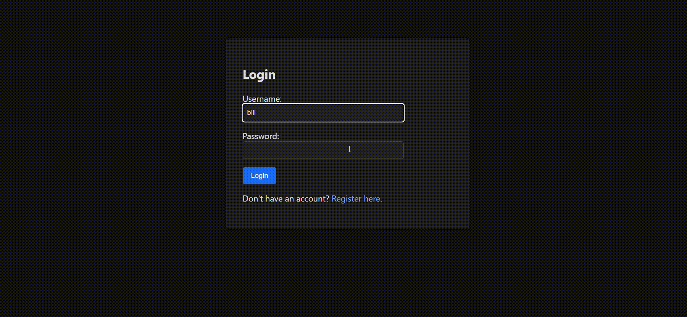
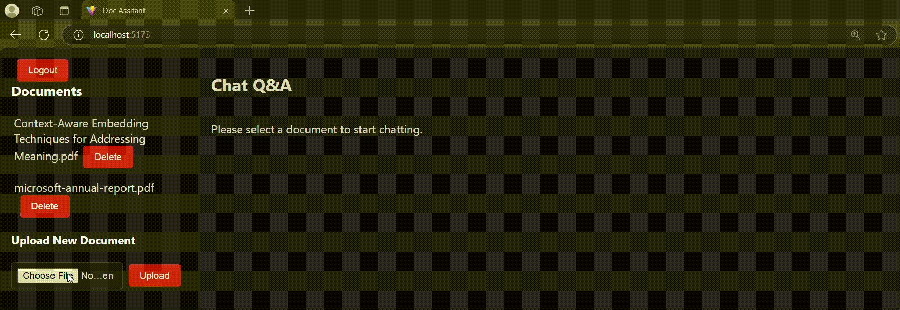
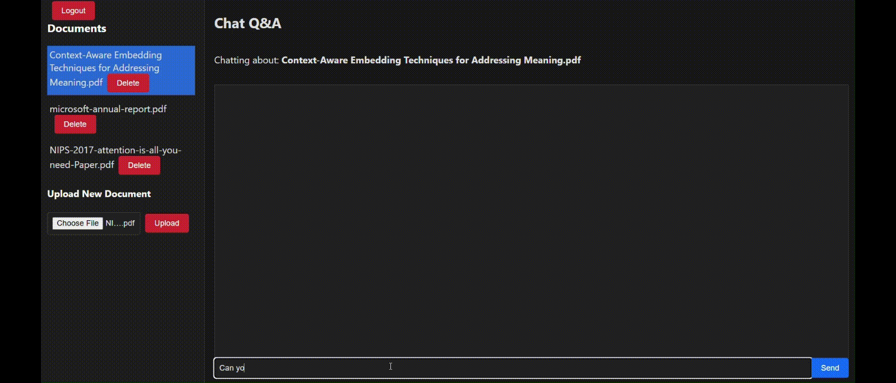
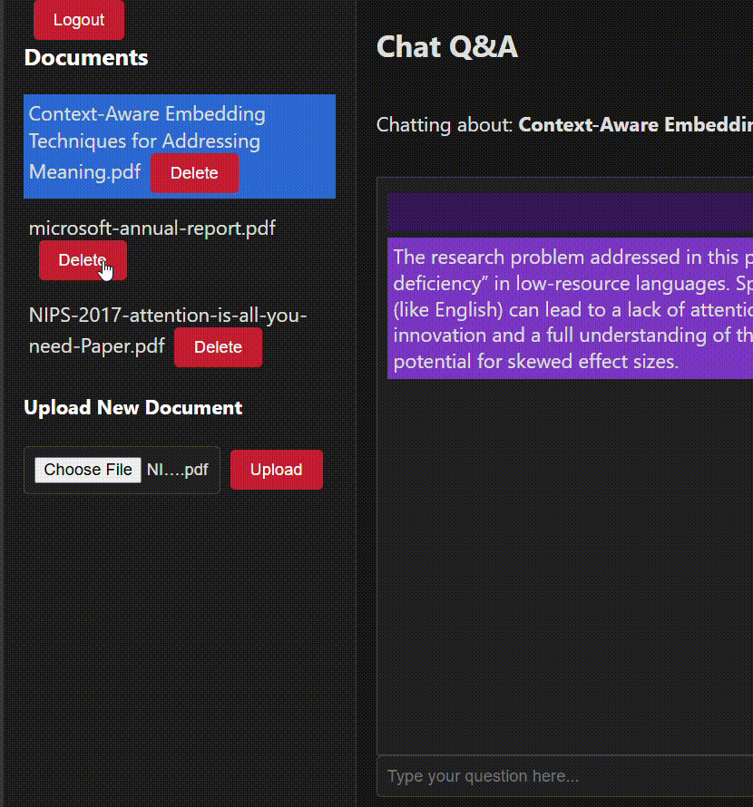

# Personal Document Q&A Assistant

A full-stack AI-powered assistant for uploading, storing, and chatting with your personal documents. Built with **NestJS**, **React**, **LangChain**, **Ollama**, **ChromaDB**, and **PostgreSQL**.

---

## Features

- User authentication (register/login)
- Upload PDF documents (max 20MB, 3 per user) --> you can tweak them as you want in the backend folder
- Document storage (PostgreSQL + ChromaDB for embeddings)
- Chat Q&A: Ask questions about your uploaded documents
- Streaming AI responses (Ollama + LangChain)
- Persistent vector search (ChromaDB)

---

## Tech Stack

- **Backend**: NestJS, TypeORM, LangChain, Ollama, ChromaDB, PostgreSQL
- **Frontend**: React, Redux Toolkit, Vite, TypeScript
- **AI**: Ollama (local LLM), LangChain
- **Vector DB**: ChromaDB
- **Database**: PostgreSQL

---

## Getting Started

### Prerequisites

- [Node.js](https://nodejs.org/) (v18+)
- [Docker](https://www.docker.com/) & [Docker Compose](https://docs.docker.com/compose/)
- [pnpm](https://pnpm.io/) or [npm](https://www.npmjs.com/)

### 1. Clone the Repository

```bash
git clone --recurse-submodules https://github.com/6ill/chat-qna-ai-bot.git
cd chat-qna-ai-bot
```

### 2. Start Required Services

```bash
docker-compose up -d
```

This will start:
- ChromaDB (vector database)
- Ollama (local LLM)
- PostgreSQL

### 3. Backend Setup

```bash
cd backend
cp .env.example .env   # Edit .env as needed
npm install
npm run start:dev
```

### 4. Frontend Setup

```bash
cd frontend
npm install
npm run dev
```

Frontend runs on [http://localhost:5173](http://localhost:5173) by default.

---

## Usage

1. Login and Register a new account.

2. Upload PDF documents (max 3 per user).

3. Select a document and start chatting with it!

4. Delete documents as needed.


---

## Environment Variables

See `backend/.env.example` for required backend environment variables.
See `./.env.example` for required environment variables for building docker container.
---


## License

MIT © 2025 Bill Hensen
